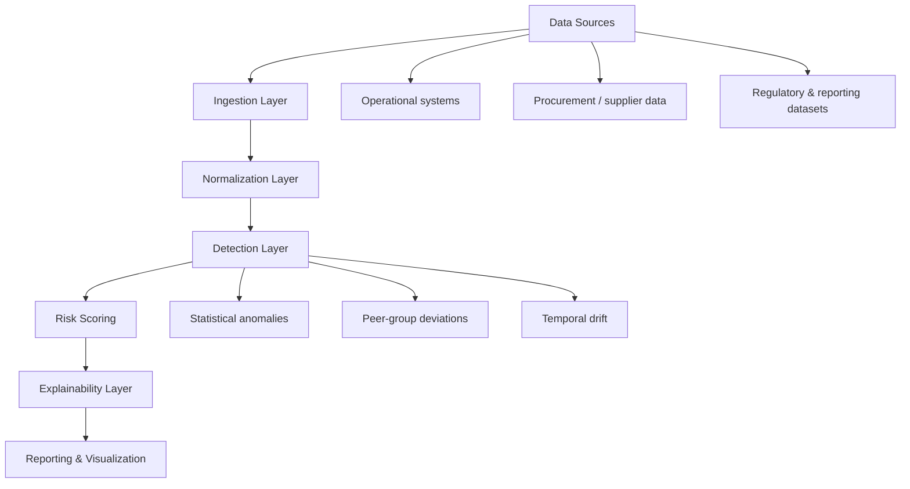

# NorthSignal Risk Engine  
### Independent Risk Signal Analytics for Regulated Industries

NorthSignal Risk Engine is a modular analytics system designed to identify **abnormal operational, procurement, and reporting patterns** in regulated industries such as **energy and mining**.

The system focuses on **risk signals** — statistically and contextually abnormal behaviors — rather than making allegations or replacing audit, compliance, or investigative functions.

---

## Why this exists

Regulated industries rely heavily on:

- Self-reported operational data  
- Supplier and procurement disclosures  
- Environmental and compliance reporting  

These datasets are often:

- Large  
- Fragmented  
- Reviewed reactively rather than proactively  

NorthSignal helps organizations **surface patterns that deserve attention earlier**, using **explainable analytics** rather than opaque black-box models.

---

## What NorthSignal does

- Normalizes heterogeneous operational and financial datasets  
- Applies statistical, temporal, and peer-group anomaly detection  
- Scores entities based on **relative risk signals**, not absolute judgments  
- Generates **human-readable explanations** for each signal  
- Produces executive-ready summaries and technical appendices  

---

## What NorthSignal does *not* do

- Does **not** label or accuse fraud  
- Does **not** replace internal audit or compliance teams  
- Does **not** ingest personal or PII data  
- Does **not** rely on speculative or unverifiable signals  

This design is intentional to ensure **legal, regulatory, and ethical safety**.

---

## Architecture overview

NorthSignal follows a **layered, enterprise-aligned analytics architecture**, designed to work with batch or incremental data while remaining explainable and auditable.

### Logical flow

All stages are **config-driven** to ensure repeatability across assessments and environments.

---

## Pipeline stages

1. **Ingestion**  
   CSV, API, or batch-based ingestion from structured sources  

2. **Normalization & standardization**  
   Schema harmonization, unit normalization, and temporal alignment  

3. **Detection**  
   Statistical, temporal, and peer-based anomaly detection techniques  

4. **Risk scoring**  
   Weighted, relative risk signals rather than absolute classifications  

5. **Explainability layer**  
   Human-readable reasoning for each identified signal  

6. **Reporting & visualization**  
   Executive-ready summaries and analyst-level detail  

---

## Intended users

- Internal audit teams  
- Compliance and regulatory affairs  
- Risk management functions  
- Independent reviewers and advisors  

---

## Status

This repository represents a **reference implementation** used for:

- Independent risk assessments  
- Proof-of-concept engagements  
- Platform evolution research  

It is intentionally scoped to avoid client-specific logic or proprietary data.

---

## Long-term vision

NorthSignal is designed to evolve into a **domain-agnostic risk intelligence platform**, where:

- New industries plug into the same risk engine  
- Detection logic becomes reusable services  
- Explainability becomes a first-class product feature  

---

## Legal & ethical note

NorthSignal provides **decision support**, not determinations.  
All outputs are intended to **inform human review**, not replace it.

